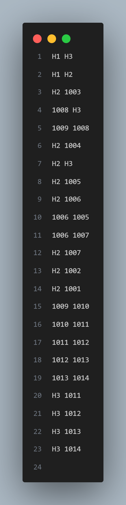
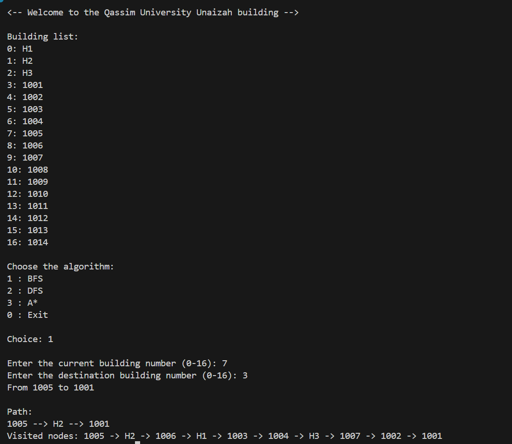
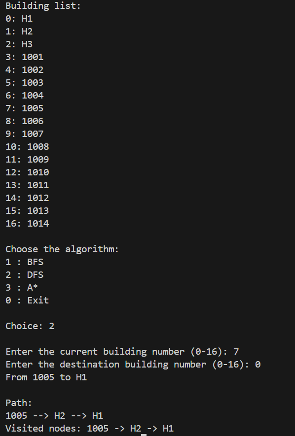
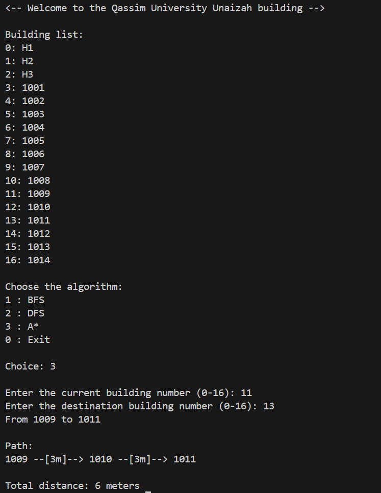

# Postal-Robot-Route-Finder
Intelligent Route Searching System for Postal Robot in Qassim University

🚩 Overview

This project focuses on developing an autonomous postal robot that delivers mail between 15+ rooms in the Student 
Affairs Department of Qassim University.The system aims to optimize the delivery routes using AI-based search
algorithms to minimize time and distance.

⚙️ Current Challenges

-Daily mail volume between 15+ rooms

-Manual delivery is time-consuming and inefficient

-Lack of real-time adaptability

-Need for accurate navigation and optimal route planning

✨Project Goal:

Develop a route-finding system using multiple search algorithms

<h3>📊 Graph Visualization</h3>

  

<h3>🗺️ Map Data - shows links between nodes </h3>

  

⚙️ How the Algorithms Work

🔵 Breadth-First Search (BFS)

BFS starts at the root node (or starting point) and explores all its neighboring 
nodes at the present depth level before moving to nodes at the next depth level.
The algorithm uses a queue to keep track of the nodes it needs to visit and processes 
them in the order they were added.

🔍How it works inside the code:

BFS starts at the starting node and explores all its neighbors.
Each unvisited neighbor is added to the queue.
BFS continues until it finds the goal or explores all nodes.

Key Point:

BFS finds the shortest path in terms of the number of steps (ignoring weights).

🔵 Depth-First Search (DFS)

DFS begins at the starting node and explores as far as possible along each branch before backtracking.
The algorithm uses recursion or a stack to keep track of visited nodes.

🔍How it works inside the code:

DFS visits one node, then its neighbor, and keeps going deeper.
When it reaches a node with no unvisited neighbors, it backtracks.
This process continues until all nodes are explored.

Key Point:

DFS does not guarantee the shortest path, but it’s great for exploring all paths.

🔵 A* (A-star) Algorithm

A* is an informed search algorithm that combines actual cost and heuristic estimation to find the shortest path.

🔍How it works inside the code:

Uses a priority queue to choose the next node based on the lowest total cost.

f(n)=g(n)+h(n)
f(n)=g(n)+h(n)

g(n) = actual cost from start to current node.

h(n) = estimated cost to goal (heuristic).

Always explores the node with the smallest f(n).

Key Point:

A* is optimal and efficient if the heuristic is well-designed.

<h3>🔵 BFS Output</h3>

  

<h3>🔵 DFS Output</h3>

  

<h3>🔵 A* (A-star) Output</h3>

  

